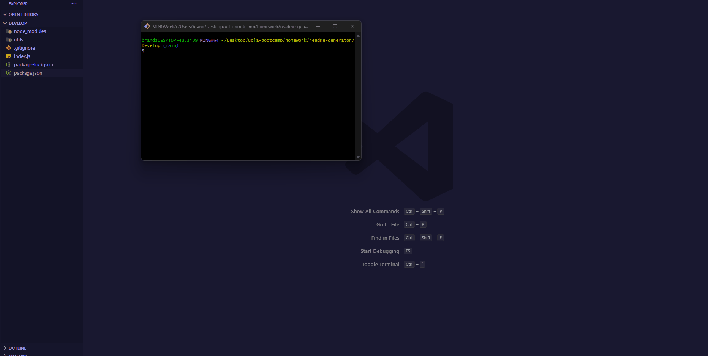

# ReadMe Generator

## Description
This password generator was developed using JavaScript, HTML, and CSS. You may generate a random password that contains lowercase letters, uppercase letters, numbers, and symbols.


## Installation
* Run ```npm i```

## Usage


## Features
Will generate a professional read me after answering a series of questions

Includes the following prompts
* 'What is the title of your project?'
* 'Enter a description of your project'
* 'Enter your installation details'
* 'Enter instructions on how users can use your software'
* 'Which license did you use?'
* 'Who helped you with this software?'
* 'List the type of tests your software contains'
